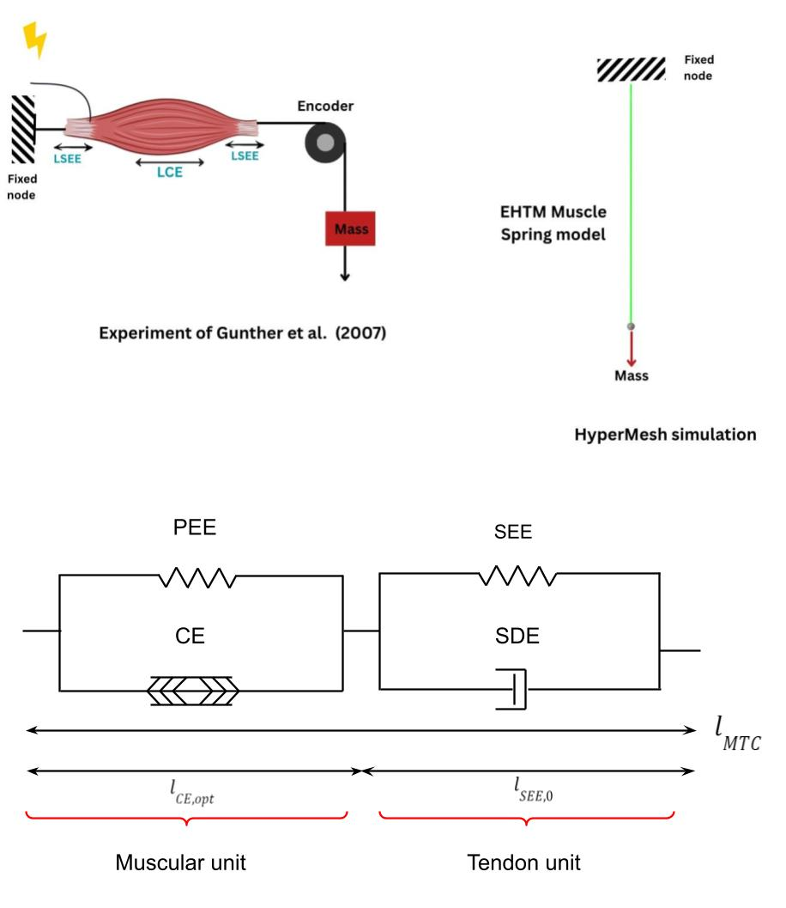

# Extended-Hill-Type-Muscle--1D-user-spring-for-OpenRadioss
# Introduction
This project is a derivative work of the original LS-DYNA implementation by Haeufle (2014) et al. and Martynenko et al. (2023), redistributed under the BSD 3-Clause License. The model is based on the Enhanced Hill-Type Model (EHTM) and has been translated, refactored, and validated to operate within the OpenRadioss material framework.
The aim is to give FEM users a ready-to-use muscle contraction material law that can be integrated into larger biomechanical simulations, such as head–neck models for high-impact accident studies.

The model represents a single muscle–tendon unit and captures the main mechanical and physiological behaviors of active muscle tissue:
- Contractile element (CE) for active force generation
- Parallel elastic element (PEE) for passive stiffness
- Series elastic element (SEE) for tendon elasticity
- Serial damping element (SDE) adds a velocity-dependent force term in series with the CE and SEE, improving stability and making the model better at reproducing rapid loading/unloading responses

All parameters are taken from experimental data and literature Günther et al. (2007), (Kleinbach et al., 2017),  (Martynenko et al., 2023), ensuring that the model is both physiologically realistic and numerically stable.
Example input files, Fortran implementation, and plots of the force–length and force–velocity relationships are provided for reference.

# Options and Keywords used
# Model description
The EHTM encapsulates the physiomechanical behavior of a muscle–tendon unit via four sequential components:

### 1. Contractile Element CE
- Generates active force based on excitation and activation dynamics, modulated by force–length and force–velocity relationships.
### 2. Series Elastic Element SEE
- Models tendon elasticity using a piecewise law: a non-linear region followed by a linear response at higher elongations.
### 3. Parallel Elastic Element PEE
- Models passive force in parallel with CE
- Activated only when CE length exceeds LPEE,0
- uses an exponential stiffness law
### 4. Serial Damping Element SDE
- Adds velocity-dependent damping to stabilize the system under dynamic loading.

## Muscle Activation Dynamics

This model simulates the activation of a single muscle fiber using a step-type stimulation (STIM) signal as the input. The stimulation represents the neural trigger from the experiment and is converted into muscle activation through a chemo-physiological process.

The model includes two calcium ion diffusion methods: Zajac (1989) and Hatze (1978). In this implementation, the Hatze method is used, following Kleinbach et al. (2017). The Hatze approach calculates the muscle activation level q based on: 
- The muscle activation $q$ depends on the contractile element length $l_{CE}$ and calcium ion concentration $\gamma_{\mathrm{rel}}$.

  
$$
q_{\text{rel}} = q_0 + \frac{(\rho \, \gamma_{\text{rel}})^3}{1 + (\rho \, \gamma_{\text{rel}})^3}
$$


$$
\frac{d\gamma_{\mathrm{rel}}}{dt} = m\,(\mathrm{STIM} - \gamma_{\mathrm{rel}})
$$


$$
\rho = c \, \eta^{(k - l_{CE,\text{rel}})}
$$


#### Muscle Model Setup


## Mechanical Contraction Model 

The active force of the contractile unit depends on the activation level *q*, the unit’s length $l_{CE}$, and its contraction velocity (dlCE/dt).
Fmax and the Hill constants $A_{rel}$ and $B_{rel}$, which shape the force–velocity and force–length relationships.

$$
F_{CE}\left(l_{CE}, \dot{i}_{CE}, q\right) = F_{\max}\left(\frac{q F_{\mathrm{isom}} + A_{\mathrm{rel}}}{1 - \dfrac{\dot{i}_{CE}}{B_{\mathrm{rel}}\, l_{CE,\mathrm{opt}}}}- A_{\mathrm{rel}}\right)
$$

The isometric force depends solely on 𝑙𝐶𝐸, following a bell-shaped curve whose slope and width are controlled by ∆𝑊𝑙𝑖𝑚𝑏 and 𝜈𝐶𝐸,𝑙𝑖𝑚𝑏.

$$
F_{isom}(l_{CE}) = \exp \left( - \left| \frac{\frac{l_{CE}}{l_{CE,opt}} - 1}{\Delta W_{limb}} \right|^{\nu_{CE,limb}} \right)
$$


The passive mechanical property of muscle fibres where K and v are stiffness components: 

$$
F_{PEE} =
\begin{cases}
0, & l_{CE} < l_{PEE,0} \\
K_{PEE} \left( l_{CE,opt} - l_{PEE,0} \right)^{\nu_{PEE}}, & l_{CE} \ge l_{PEE,0}
\end{cases}
$$

The second part of the EHTM models tendons, using a nonlinear elastic element and an adaptive damping component to reflect their fibrous nature. This approach captures the initial nonlinear response caused by collagen fiber reorganization, followed by a linear stiffness phase.

$$
F_{SEE}(l_{SEE}) =
\begin{cases}
0, & \text{if } l_{SEE} < l_{SEE,0} \\
K_{SEE,nl} \left( l_{SEE} - l_{SEE,0} \right)^{\nu_{SEE}}, & \text{if } l_{SEE} \ge l_{SEE,0} \text{ and } l_{SEE} < l_{SEE,nll} \\
\Delta F_{SEE,0} + K_{SEE,l} \left( l_{SEE} - l_{SEE,nll} \right), & \text{if } l_{SEE} \ge l_{SEE,nll}
\end{cases}
$$


In the EHTM model, the SDE damping element is adaptive, using a minimum damping value $R_{SDE}$ and a non-dimensional scale factor $r_{SDE}$ to reduce high-frequency instability.

$$
F_{SDE}\left(l_{CE}, \dot{l}_{SDE}, q\right)=d_{SDE,\max}\left[\left(1 - R_{SDE}\right)\frac{F_{CE} + F_{PEE}}{F_{\max}}+ R_{SDE}\right]\dot{l}_{SDE}
$$

$$
d_{SDE,\max} = D_{SDE}\frac{F_{\max}\,A_{\mathrm{rel},0}}{l_{CE,\mathrm{opt}}\,B_{\mathrm{rel},0}}
$$

# Boundary Conditions

This 1D muscle–tendon unit is exercised in pure axial loading:

- **Nodes & element**
  - `NODE 1` (origin/proximal end) — fixed support
  - `NODE 2` (distal end/loading point) — moves only along the muscle axis (Y)
  - One user spring (EHTM) connects `NODE 1` → `NODE 2`

- **Kinematic constraints**
  - `NODE 1`: fully constrained (translations + rotations)
  - `NODE 2`: X and Z fixed; Y free (axial motion)

- **Loading**
  - A **point mass of (100 g)** is attached at the loading node
  - **Gravity** acts in −Y using a constant time function (9.81 m/s² in the working unit system)

- **What to monitor**
  - Displacement **DY** and velocity **VY** of `NODE 2` via `/TH/NODE`


## OpenRadioss keywords

```text
# --- Node groups (example) ---------------------------------
# Group 1: fixed node (NODE 1)
# Group 2: loading node (NODE 2)
# Group 3: gravity mass node group (usually same as Group 2)

# --- Boundary conditions -----------------------------------
# Fix NODE 1 (all translations + rotations)
#/BCS/1
#  Tra Rot  skew_ID  grnod_ID
   111 111        0         1

# Lock X,Z and free Y on NODE 2  → translation mask 101 (X,Z fixed; Y free)
#/BCS/2
#  Tra Rot  skew_ID  grnod_ID
   101 111        0         2

# --- Added mass at loading node (0.1 kg = 100 g) -----------
#/ADMAS/0/1
#            MASS(g)  grnod_ID
               100             2

# --- Gravity in −Y -----------------------------------------
# Constant gravity defined by function 19
#/GRAV/2
#funct_IDT  DIR  skew_ID  sensor_ID  grnod_ID     Ascale_X    Fscale_Y
       19    Y        0          0         3                     -1.0

# Function 19: constant acceleration
#/FUNCT/19
#      X(time)      Y(accel)
          0.0        0.00981
       2000         0.00981

# --- Time histories at NODE 2 -------------------------------
#/TH/NODE/1
# var_ID1 var_ID2
   DY     VY
# node_ID skew_ID
      2       0

```
# Material characterization
The parameters below define the single-fiber Extended Hill-Type Muscle (EHTM) used in this repo.  
They come from the muscle-scale validation and literature synthesis.

### Activation (Hatze-type)
| Parameter          | Symbol |    Value | Units | Notes                                                                |
| ------------------ | ------ | -------: | ----- | -------------------------------------------------------------------- |
| Minimum activation | $q_0$  |   5.0e-3 | –     | Baseline activation level                                            |
| Calcium gain       | $c$    | 1.373e-4 | mol/L | Hatze parameter                                                      |
| Calcium scaling    | $\eta$ |  5.27e+4 | L/mol | Hatze parameter                                                      |
| Exponent           | $k$    |      2.9 | –     | Hatze parameter                                                      |
| Relaxation rate    | $m$    |  11.3e-3 | 1/ms  | $\frac{d\gamma_{\mathrm{rel}}}{dt} = m\(\mathrm{STIM} - \gamma_{\mathrm{rel}})$ |

### Isometric Force - Length
| Parameter             | Symbol                    | Value | Units | Notes                  |
| --------------------- | ------------------------- | ----: | ----- | ---------------------- |
| Max. isometric force  | $F_{\max}$                |    30 | N     | Peak active force      |
| Optimal fiber length  | $l_{CE,\mathrm{opt}}$     |    15 | mm    | At $F_{\max}$          |
| Width (descending)    | $\Delta W_{\mathrm{des}}$ |  0.14 | –     | F-L curve width (desc.) |
| Exponent (descending) | $\nu_{CE,\mathrm{des}}$   |   3.0 | –     | F-L shape (desc.)       |
| Width (ascending)     | $\Delta W_{\mathrm{asc}}$ |  0.57 | –     | F-L curve width (asc.)  |
| Exponent (ascending)  | $\nu_{CE,\mathrm{asc}}$   |   4.0 | –     | F-L shape (asc.)        |

### Force - Velocity, Hill Parabola
| Parameter       | Symbol               |  Value | Units | Notes |
| --------------- | -------------------- | -----: | ----- | ----- |
| Hill constant A | $A_{\mathrm{rel},0}$ |    0.1 | –     |       |
| Hill constant B | $B_{\mathrm{rel},0}$ | 1.0e-3 | –     |       |

### Parallel Elastic Element 
| Parameter               | Symbol      | Value | Units | Notes                                                            |
| ----------------------- | ----------- | ----: | ----- | ---------------------------------------------------------------- |
| Activation length ratio | $L_{PEE,0}$ |   0.9 | –     | PEE active when $l_{CE} \ge L_{PEE,0} \cdot l_{CE,\mathrm{opt}}$ |
| Stiffness exponent      | $\nu_{PEE}$ |   2.5 | –     | $F_{PEE}\propto(l_{CE}-l_{PEE,0})^{\nu_{PEE}}$                   |
| PEE scale               | $F_{PEE}$   |   1.0 | –     | Dimensionless scale (maps to $K_{PEE}$ in code)                  |

### Series Elastic Element 
| Parameter      | Symbol               |  Value | Units | Notes                   |
| -------------- | -------------------- | -----: | ----- | ----------------------- |
| Slack length   | $l_{SEE,0}$          |     45 | mm    | Zero-force length       |
| Nonlinear span | $\Delta U_{SEE,nll}$ | 0.1825 | –     | To transition point     |
| Linear span    | $\Delta U_{SEE,l}$   |  0.073 | –     | Linear region scale     |
| Force at SEE   | $\Delta F_{SEE,0}$   |     60 | N     | Offset at $l_{SEE,nll}$ |

### Serial Damping Element
| Parameter          | Symbol         |                                                                                  Value | Units   | Notes               |
| ------------------ | -------------- | -------------------------------------------------------------------------------------: | ------- | ------------------- |
| Damping scale      | $D_{SDE}$      |                                                                                    0.3 | –       | Sets $d_{SDE,\max}$ |
| Min. damping ratio | $R_{SDE}$      |                                                                                   0.01 | –       |                     |
| Max. damping       | $d_{SDE,\max}$ | $D_{SDE}\,\dfrac{F_{\max} A_{\mathrm{rel},0}}{l_{CE,\mathrm{opt}} B_{\mathrm{rel},0}}$ | N·ms/mm | Derived from above  |

##### Units: This model uses mm and ms (with N for force).

# References
The following publications provide the theoretical background and validation for the Extended Hill-Type Muscle (EHTM) model and related muscle material models used in this repository.

1. **Kleinbach, C., Martynenko, O., Promies, J., Haeufle, D. F. B., Fehr, J., & Schmitt, S.** (2017).  
   *Implementation and validation of the extended Hill-type muscle model with robust routing capabilities in LS-DYNA for active human body models.*  
   BioMedical Engineering OnLine, 16(1), 109.  
   [https://doi.org/10.1186/s12938-017-0399-7](https://doi.org/10.1186/s12938-017-0399-7)  

2. **Martynenko, O., Kleinbach, C., Promies, J., Fehr, J., Haeufle, D. F. B., & Schmitt, S.** (2023).  
   *Development and verification of a physiologically based Hill-type muscle material model in LS-DYNA for Active Human Body Models.*  
   Computer Methods in Biomechanics and Biomedical Engineering, 26(14), 1630–1648.  
   [https://doi.org/10.1080/10255842.2023.2251766](https://doi.org/10.1080/10255842.2023.2251766)  


3. **Günther, M., Röhrle, O., Schmitt, S., & Blickhan, R.** (2007).  
   *High-frequency oscillations as a consequence of neglected serial damping in Hill-type muscle models.*  
   Biological Cybernetics, 97(1), 63–79.  
   [https://doi.org/10.1007/s00422-007-0154-3](https://doi.org/10.1007/s00422-007-0154-3)  

4. **Haeufle, D. F. B., Günther, M., Bayer, A., & Schmitt, S.** (2014).
    *Hill-type muscle model with serial damping and eccentric force–velocity relation.*
    Journal of Biomechanics, 47(6), 1531–1536.
    [https://doi.org/10.1016/j.jbiomech.2014.02.009](https://doi.org/10.1016/j.jbiomech.2014.02.009)

